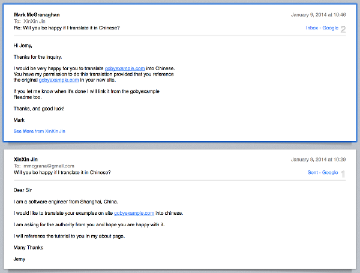
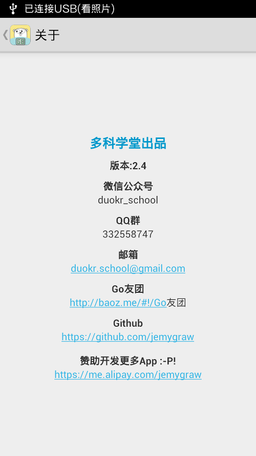
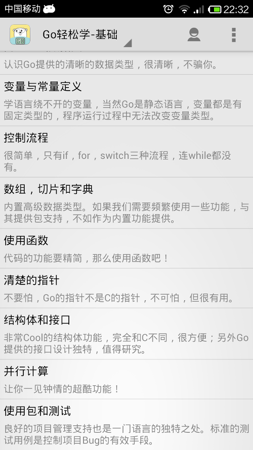
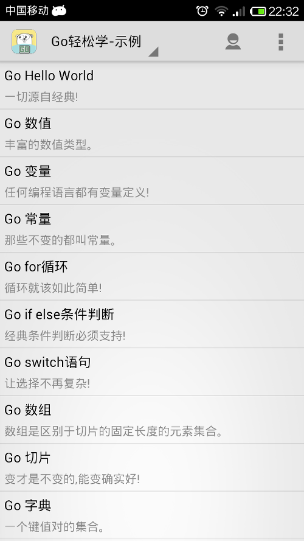
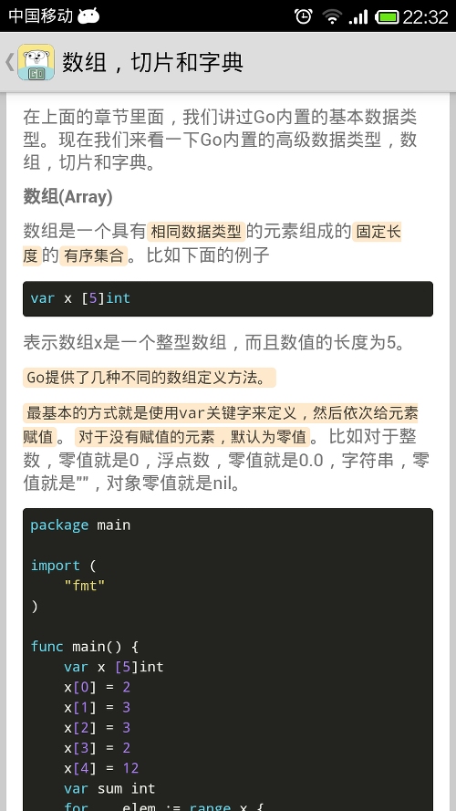
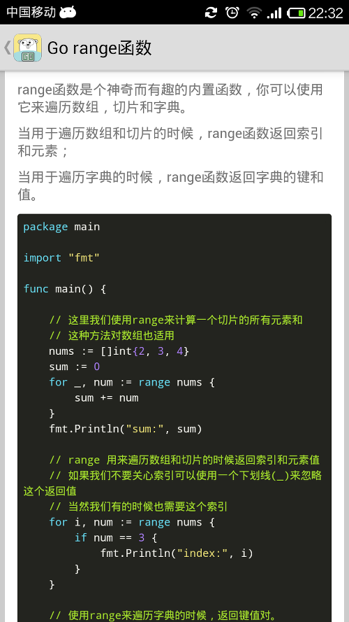
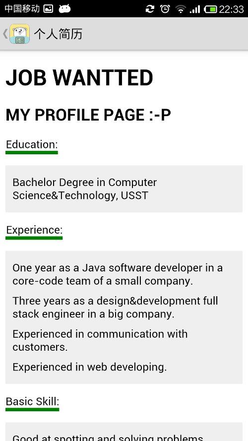

#GoQuickLearn

**Go轻松学**是我推出的一款学习GoLang的小型学习App。基于Android平台。主要包含**Go基础**和**Go实例**两部分。

最新apk下载地址 [http://pan.baidu.com/s/1mgI5GSw](http://pan.baidu.com/s/1mgI5GSw)

Go基础部分由本人的读书笔记归纳整理而来，而实例部分则由网址[http://gobyexample.com](http://gobyexample.com)翻译而来。翻译之前已经通过邮件获得了原作者的允许。

>

下面是效果图：

##赞助开发更多App！[https://me.alipay.com/jemygraw](https://me.alipay.com/jemygraw)
